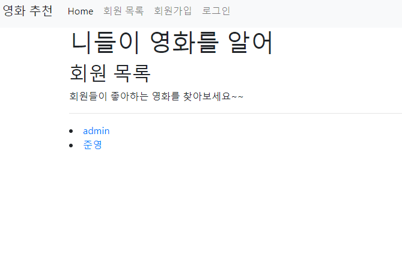
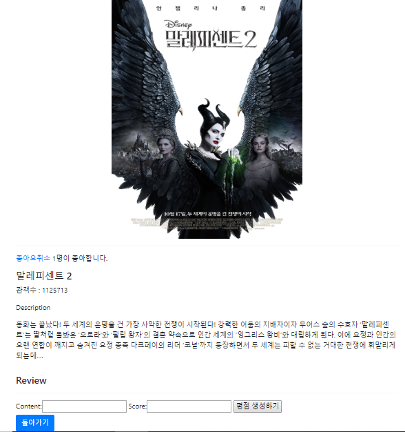

# 10 - Django(Pair Programming)

## 결과

### 1.  `accounts` App

1. 유저목록(`/accounts/`)

   ```python
   # account/views.py
   def index(request):
       users = get_user_model().objects.all()
       return render(request, 'accounts/index.html', {'users': users})
   ```

   ```html
   <!-- account/index.html -->
   
   
   
       <h2>회원 목록</h2>
       <p>회원들이 좋아하는 영화를 찾아보세요~~</p>
       <hr>
       
       <li>
       <a href="">
           {{ user.username }}
       </a>
       </li>    
       
   
   
   ```

   

2. 상세 보기(`account/{user_pk}/`)

   ```python
   # accounts/views.py
   import random
   def detail(request, user_id):
       user = get_object_or_404(get_user_model(), pk=user_id)
       if user.like_movies.exists():
           genre = user.like_movies.all()[0].genre.movie_set.all()
           for movie in genre:
               if movie not in user.like_movies.all():
                   recommand = movie
                   break
           else:
               recommand = Movie.objects.all()[random.randint(0, 9)]
               while recommand in user.like_movies.all():
                   recommand = Movie.objects.all()[random.randint(0, 9)]
       else:
           recommand = Movie.objects.all()[random.randint(0, 9)]
           while recommand in user.like_movies.all():
               recommand = Movie.objects.all()[random.randint(0, 9)]
       return render(request, 'accounts/detail.html', {'user': user, 'recommand':recommand})
   ```

   ```html
   <!-- accounts/detail.html -->
   
   
       <h2>{{ user.username }}</h2>
       <hr>
       
       <a href="">
       
       좋아연 취소
       
       좋아연
       
       </a>
       
       <p>팔로워 수: {{user.followers.count}}</p>
       <p>팔로잉 수: {{user.followings.count}}</p>  
       <hr>
       <h4>리뷰 목록</h4>
       
       
           <hr>
           <h4>{{ review.movie.title }}</h4>
           <p>{{ review.content }}</p>
           <p>{{ review.score }}</p>
           <hr>
       
       
       <p>리뷰가 없네요 ㅠ</p>
       <hr>
       
       
       <h3>추천영화</h3>
       <a href="">
           
       </a>
       <hr>
       <a href=""><button class="btn btn-primary"> 돌아가기</button></a>
   
   ```

   

### 2. `movies` App

1. 영화 목록(`/movies/`)

   ```python
   # movies/views.py
   def index(request):
       movies = Movie.objects.all()
       return render(request, 'movies/index.html', {'movies' : movies})
   ```

   ```html
   <!-- movies/index.html -->
   
   
    a:hover {
        color: black
        
    },
    a:link {
        color: black
    }
   
   
       <div class="row">
           
           <a href="" style="text-decoration: none; color:black;">
           <div class="card mx-auto my-3" style="width: 18rem;">
               
           <div class="card-body">
           <h5 class="card-title">{{ movie.title }}</h5>
           </a>
     </div>
   </div>
   
           
       </div>
   
   ```

   

2. 영화 상세보기(`/movies/{movie_pk}`)

   ```python
   # movies/views.py
   def detail(request, movie_id):
       movie = get_object_or_404(Movie, pk=movie_id)
       form = ReviewForm()
       return render(request, 'movies/detail.html', {'movie' : movie, 'form':form})
   ```

   ```html
   
   
   .center {
     display: block;
     margin-left: auto;
     margin-right: auto;
     width: 50%;
   }
   
   
       
       <hr>
       <a href="" style="display: inline-block;">
       
       좋아요취소
       
       좋아요
       
       </a>
       <p style="display: inline-block;">{{ movie.like_users.count }}명이 좋아합니다.</p>
   
       <h3>{{ movie.title }}</h3>
       <p>관객수 : {{ movie.audience }}</p>
       <p>Description</p>
       <p>{{ movie.description }}</p>
       <hr>
       <h3>Review</h3>
       
           <h4>{{review.user.username}}</h4>
           <p>평점 : {{review.score}}</p>
           <p>내용 : {{review.content}}</p>
           
           <form action="" method="post">
           
           <button type="submit">X</button>
           </form>
           
       
       <hr>
       <form action="" method="post">
           
           {{ form }}
           <button type="submit">평점 생성하기</button>
       </form>
       <a href=""><button class="btn btn-primary"> 돌아가기</button></a>
   
   ```

   

3. 평점 생성 및 삭제

   ```python
   # movies/views.py
   @require_POST
   def create(request, movie_id):
       if request.user.is_authenticated:
           form = ReviewForm(request.POST)
           if form.is_valid():
               review = form.save(commit=False)
               review.user = request.user
               review.movie = get_object_or_404(Movie, pk=movie_id)
               review.save()
               return redirect('movies:detail', movie_id)
       else:
           return redirect('accounts:login')
       
   @require_POST
   def delete(request, movie_id, review_id):
       if request.user.is_authenticated:
           review = get_object_or_404(Review, pk=review_id)
           if review.user == request.user:
               review.delete()
       return redirect('movies:detail', movie_id)
   ```

   

   

4. 영화 좋아요 기능 구현

   ```python
   # movies/views.py
   @login_required
   def like(request, movie_id):
       if request.user.is_authenticated:
           movie = get_object_or_404(Movie, pk=movie_id)
           if request.user in movie.like_users.all():
               movie.like_users.remove(request.user)
           else:
               movie.like_users.add(request.user)
       return redirect('movies:detail', movie_id)
   ```

   

### 느낀점

이번 협업 프로젝트를 하게 되면서 혼자라면 힘들었던 것을 같이 함으로서 수월하게 진행하여 좋았습니다.